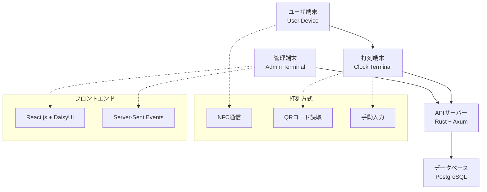

# 設計書

## 概要

タイムカードサービスは、従業員の出勤・退勤打刻を管理するWebアプリケーションです。社員通用口に設置された端末での打刻機能（NFC、QRコード、手動入力）と、管理者向けの勤怠管理機能を提供します。

## アーキテクチャ

### システム構成



### 技術スタック

- **バックエンド**: Rust + Axum + SQLx
- **データベース**: PostgreSQL
- **フロントエンド**: React.js + TypeScript + DaisyUI (Tailwind CSS) + Storybook
- **認証**: JWT (JSON Web Token)
- **通信**: REST API + Server-Sent Events (リアルタイム更新用)
- **端末通信**: HTTPS + WebSocket
- **開発環境**: Docker Compose
- **本番環境**: Kubernetes (k8s)

## コンポーネントと インターフェース

### APIエンドポイント

#### 認証関連
- `POST /api/auth/login` - ログイン
- `POST /api/auth/logout` - ログアウト
- `GET /api/auth/verify` - トークン検証

#### 打刻関連
- `POST /api/timecard/clock-in` - 出勤打刻
- `POST /api/timecard/clock-out` - 退勤打刻
- `GET /api/timecard/status/{employee_id}` - 現在の打刻状態取得
- `POST /api/timecard/nfc-clock` - NFC打刻
- `POST /api/timecard/qr-clock` - QRコード打刻

#### 勤怠履歴関連
- `GET /api/timecard/history/{employee_id}` - 個人の勤怠履歴取得
- `GET /api/timecard/history/{employee_id}/{year}/{month}` - 月別履歴取得

#### 管理者機能
- `GET /api/admin/employees` - 全従業員の勤怠状況取得
- `GET /api/admin/export` - 勤怠データエクスポート（CSV）
- `GET /api/admin/terminals` - 端末管理
- `GET /api/admin/dashboard` - ダッシュボードデータ

#### 端末関連
- `POST /api/terminal/register` - 端末登録
- `POST /api/terminal/heartbeat` - 端末生存確認
- `POST /api/terminal/sync` - データ同期
- `GET /api/terminal/qr/{terminal_id}` - QRコード生成
- `POST /api/terminal/login` - 打刻端末での従業員ログイン
- `POST /api/terminal/admin/login` - 打刻端末での管理者ログイン
- `POST /api/terminal/nfc-register` - 打刻端末でのNFC登録
- `PUT /api/terminal/nfc-update` - 打刻端末でのNFC更新

### データモデル

#### Employee (従業員)
```rust
#[derive(Serialize, Deserialize, sqlx::FromRow)]
pub struct Employee {
    pub id: Uuid,
    pub employee_id: String,
    pub name: String,
    pub email: String,
    pub role: EmployeeRole,
    pub nfc_id: Option<String>,
    pub pin_code: Option<String>,
    pub created_at: DateTime<Utc>,
    pub updated_at: DateTime<Utc>,
}

#[derive(Serialize, Deserialize, sqlx::Type)]
#[sqlx(type_name = "employee_role", rename_all = "lowercase")]
pub enum EmployeeRole {
    Employee,
    Admin,
}
```

#### TimeRecord (勤怠記録)
```rust
#[derive(Serialize, Deserialize, sqlx::FromRow)]
pub struct TimeRecord {
    pub id: Uuid,
    pub employee_id: Uuid,
    pub clock_in_time: DateTime<Utc>,
    pub clock_out_time: Option<DateTime<Utc>>,
    pub work_duration_minutes: Option<i32>,
    pub terminal_id: Uuid,
    pub clock_method: ClockMethod,
    pub date: NaiveDate,
    pub created_at: DateTime<Utc>,
    pub updated_at: DateTime<Utc>,
}

#[derive(Serialize, Deserialize, sqlx::Type)]
#[sqlx(type_name = "clock_method", rename_all = "lowercase")]
pub enum ClockMethod {
    Nfc,
    Qr,
    Manual,
    Web,
}
```

#### Terminal (端末)
```rust
#[derive(Serialize, Deserialize, sqlx::FromRow)]
pub struct Terminal {
    pub id: Uuid,
    pub name: String,
    pub location: String,
    pub ip_address: String,
    pub last_heartbeat: DateTime<Utc>,
    pub status: TerminalStatus,
    pub created_at: DateTime<Utc>,
    pub updated_at: DateTime<Utc>,
}

#[derive(Serialize, Deserialize, sqlx::Type)]
#[sqlx(type_name = "terminal_status", rename_all = "lowercase")]
pub enum TerminalStatus {
    Online,
    Offline,
    Maintenance,
}
```

### フロントエンド構成

#### Storybook設計システム
- **コンポーネントライブラリ**: 再利用可能なUIコンポーネントの管理
- **デザイントークン**: 色、フォント、スペーシングの統一
- **インタラクションテスト**: ユーザー操作のテストとドキュメント化
- **アクセシビリティ**: a11yアドオンによるアクセシビリティチェック

#### DaisyUIコンポーネント活用
- **ナビゲーション**: navbar, breadcrumbs
- **フォーム**: input, select, button, checkbox
- **データ表示**: table, card, badge, stats
- **フィードバック**: alert, toast, modal
- **レイアウト**: container, grid, divider

#### ページ構成
1. **ログインページ** - hero, card, form
2. **従業員ダッシュボード** - stats, timeline, table
3. **管理者ダッシュボード** - stats, charts, table
4. **端末画面** - hero, card, button (大きめのUI)

## エラーハンドリング

### Rustエラー型
```rust
#[derive(Debug, thiserror::Error)]
pub enum AppError {
    #[error("Authentication required")]
    AuthRequired,
    #[error("Invalid credentials")]
    InvalidCredentials,
    #[error("Employee already clocked in")]
    AlreadyClockedIn,
    #[error("Employee not clocked in")]
    NotClockedIn,
    #[error("Terminal offline: {terminal_id}")]
    TerminalOffline { terminal_id: String },
    #[error("Database error: {0}")]
    Database(#[from] sqlx::Error),
    #[error("Validation error: {0}")]
    Validation(String),
}
```

### エラーレスポンス形式
```rust
#[derive(Serialize)]
pub struct ErrorResponse {
    pub error: ErrorDetail,
}

#[derive(Serialize)]
pub struct ErrorDetail {
    pub code: String,
    pub message: String,
    pub details: Option<serde_json::Value>,
}
```

## テスト戦略

### 単体テスト
- Rustの`#[cfg(test)]`モジュールでAPIハンドラーテスト
- SQLxのテストデータベースでリポジトリテスト
- ビジネスロジックの単体テスト

### 統合テスト
- `tests/`ディレクトリでAPIエンドポイント統合テスト
- データベースマイグレーションテスト
- 端末通信プロトコルテスト

### E2Eテスト
- Playwright/Cypressでブラウザテスト
- 打刻フローの完全テスト
- 管理者機能のワークフローテスト

### パフォーマンステスト
- 同時打刻処理のロードテスト
- データベースクエリの最適化検証
- メモリ使用量とレスポンス時間の測定